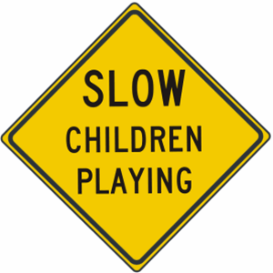

# READ ME

One of the biggest issues in student designs' is whitespace (a.k.a. negative space). Whitespace is an important design tool, which helps us to provide spacial contrast.

Take this sign for example:

 

What is this sign telling us? "Slow Children" are playing? Or "Slow Down!" because children are playing?

Notice the whitespace between "slow", "children" and "playing" is equal. How do we know what "children" is associated with? Slow or playing?

## Whitespace in Web Design

By default, browser styles apply whitespace on most semantic, block elements (i.e. headings, paragraphs, etc.). It is not applied to structural tags.

You can see these defaults by examining each item in the browsers' developer tools. (In Firefox, when  yellow appears on the screen around an element, it indicates margin, which is what creates the whitespace.)

How to eliminate this default? Adjust an element's margin.

When you need to eliminate whitespace completely, set margin (on whatever sides necessary) to zero (0).

When you need to add whitespace, give it a pixel value.

## Examples

- `whitespace-no-css.html` shows how the page appears without any CSS applied. Notice the spacing between the headings and paragraphs. While, yes, the font size and weight help distinguish what content is related, it could be much better.

- `whitespace.html` shows an example of better whitespace usage. Headings (`h3`) and paragraphs have margin removed. `article` tags have margin applied at the bottom. Notice how we can now tell which bits of information are related for each heading, and yet each entry (each degree earned) are separate from one another. See how it's easier to understand what text is related and what is not? :)
